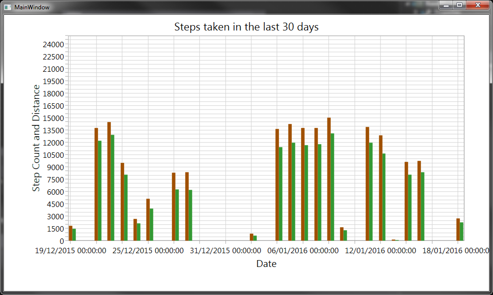

# Microsoft Band Workout

A sample project to get data from Microsoft Band and Health Cloud API.

Uses Syncfusion chart control to visualise data:

In order to be able to get results from Microsoft Health Cloud API, you need to register your own app and update the Settings with your own Client ID and Client Secret

